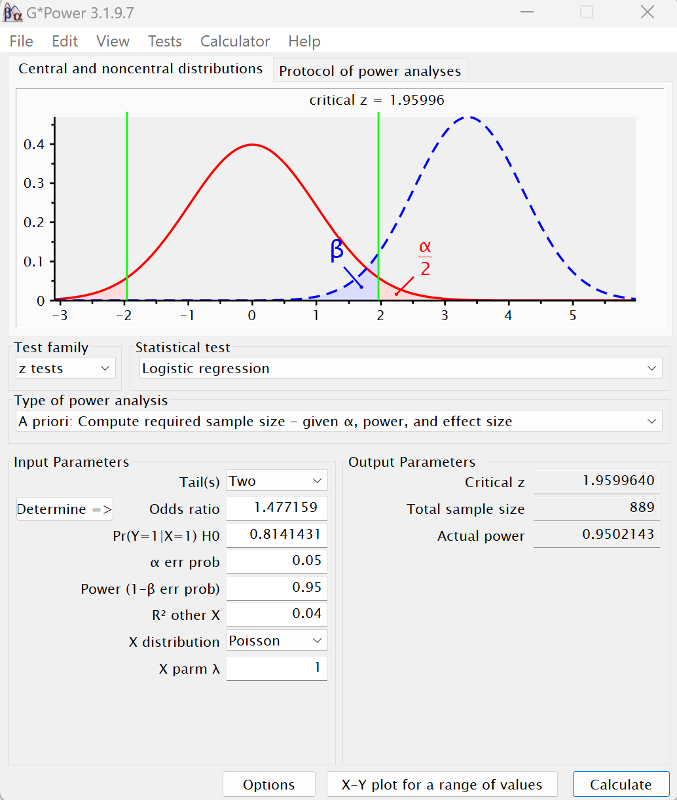

```{r setup, include=FALSE}
knitr::opts_chunk$set(echo = TRUE, warning = FALSE)
```

## Alen Krotov 

<br>

### Table Of Contents 

* [Introduction](#intro)

* [1. Do the explanatory variables: gender, age, intracranial volume (eTIV) and cognitive Mini-Mental State Examination (MMSE) score have an effect on dementia disease status?](#firstQ)

  * [Parametric description of the model](#ModelDescription)

  * [Model Hypothesis](#ModelHypothesis)

  * [Descriptive statistics](#FirstQStats)

  * [Model Assumptions Testing](#Testing_The_Model_Assumptions)

    1. [Independence Between The Explanatory Variables](#Testing_The_Model_Assumptions_1)

    2. [Sufficient Sample Size](#Testing_The_Model_Assumptions_2)

  * [Model Analysis](#ModelAnalysis)

  * [Goodness-Of-Fit of The Model Measurement](#GOF)

  * [References](#Reference)
  
* [2. Was there a difference in mortality between Alzheimer's disease and Parkinson's disease in the US between 1990 and 2019?](#SecondQ)

  * [Descriptive Statistics](#SecondQStats)
  
  * [Correlations](#SecondQCorrelation)
  
  * [t Test](#SecondQ_tTest)
  
  * [Normality Assumption Test](#SecondQ_Assumption1)
  
  * [Equality of Differences](#SecondQ_Assumption2)
  
  * [t Test Adjusted For Different Variances](#SecondQ_tTest_VarFALSE)
  
* [3. Is there a difference in the incidence of patients between men and women?](#ThirdQ)
  
  * [Fisher Test Hypothesis Testing - For Independent Samples](#ThirdQ_Assumptions)
  
  * [Descriptive Statistics (before Fisher's test)](#ThirdQ_Stat)
  
  * [Fisher Test](#ThirdQ_Fisher)
  
* [4. Is there an age difference between the groups of people who are not affected by dementia, people with mild dementia, and people with severe dementia?](#FourthQ)
  
  * [Descriptive Statistics](#FourQ_Stat)
  
  * [Statistical Analysis](#Stat_Analysis)
  
  * [First Assumption Test - Normal Distribution by Kolmogorov-Smirnov Test](#FourQ_Assumptions1)
  
  * [Satistical Analysis According to Kruskal-Wallis Test](#FourQ_Kruskal-Wallis)
  
  * [Box Plot Chart](#FourQ_BoxPlot)
  
  * [Bar Graph](#FourQ_BarGraph)
  
  * [Correlation](#FourQ_Corr)
  
  * [Scatter Plot (3D)](#FourQ_3D_Graph)
  
<br>

### Introduction {#intro}

Dementia, a syndrome characterized by a decline in cognitive function beyond what is expected from normal aging, affects various mental abilities such as memory, thinking, orientation, comprehension, calculation, learning capacity, language, and judgment. Notably, consciousness remains unaffected. Alongside the impairment in cognitive function, individuals with dementia often experience a decline in emotional control, social behavior, or motivation.


Various diseases and injuries, such as Alzheimer's disease or stroke, can be attributed to the development of dementia. These conditions primarily or secondarily affect the brain.

Dementia, a leading cause of disability and dependency in older individuals globally, can be an overwhelming experience for both those afflicted with it and their caregivers and families. Lack of awareness and understanding surrounding dementia sadly leads to stigmatization and creates obstacles in receiving proper diagnosis and care. This lack of knowledge has profound impacts on caregivers, families, and society as a whole, resulting in physical, psychological, social, and economic repercussions.

For this project, we will utilize the following databases:

1. <https://www.kaggle.com/datasets/shashwatwork/dementia-prediction-dataset>

2. <https://www.kaggle.com/datasets/iamsouravbanerjee/cause-of-deaths-around-the-world>

### 1. Do the explanatory variables: gender, age, intracranial volume (eTIV) and cognitive Mini-Mental State Examination (MMSE) score have an effect on dementia disease status? {#firstQ}

To answer this question, a logistic regression model will be constructed. It aims to explore the relationship between the predictor variables and the categorical explained variable that represents disease status. The explained variable will be categorized into two groups: "Demented" (1) and "Nondemented" (0).
We will use the first mentioned database in the introduction. It is important to note that the explained variable known as "disease status" initially has three levels: "Demented," "Nondemented," and an intermediate state referred to as "Converted". To simplify our analysis, we will later redefine the explained variable into two groups. Both "Demented" and "Converted" statuses will be categorized as "Demented" when the category of "Nondemented" will remain unchanged.

Where:

* Mini-Mental State Examination (MMSE) - a cognitive survey that provides a concise and objective measure of the subject's cognitive function. According to this index, the higher the score, the better the subject's cognitive function.

* Intracranial volume (eTIV) - the intracranial volume of the subject is a volume that includes the brain, the meninges (which protect the brain and spine), and cerebrospinal fluid (a clear, colorless fluid found within the tissue surrounding the brain and spine).

<br>

##### *Parametric description of the model:* {#ModelDescription}

$$
\begin{align*}
&\log(\frac{p}{1-p}) = \hat\beta_0 + \hat\beta_1 x_1 + \hat\beta_2 x_2 + ...+ \hat\beta_4 x_4 \\
&\hat{y} = \frac{1}{1+ \exp(-(\hat\beta_0 + \hat\beta_1 x_1 + \hat\beta_2 x_2 + ...+ \hat\beta_4 x_4))} 
\end{align*}
$$
Where:

* $p$ - Probability of occurrence of event 1 given $\vec{x}$.

* $\hat{y}$ - Estimated relationship to probability.

* $\{(x_1,x_2,...,x_k)|x_k \in \mathbb{R}, 1 \le k \le 4\}$ -

* $\hat\beta_0$ - The intercept.

* $\{(\hat\beta_1,\hat\beta_2,...,\hat\beta_k)|\hat\beta_k \in \mathbb{R}, 1 \le k \le 4\}$ - Regression Coefficients.

<br>

##### *Model Hypothesis* {#ModelHypothesis}

$$
\begin{align*}
&H_0: \beta_1 = \beta_2 =...= \beta_k = 0 \\ 
&H_1: else
\end{align*}
$$

Given that regression coefficients are associated as follows:

* $\beta_1$ - Gender (M.F)

* $\beta_2$ - Assessment score in a cognitive test (MMSE)

* $\beta_3$ - Intracranial volume (eTIV)

* $\beta_4$ - Age 

<br>

##### *Model Assumptions* {#ModelAssumption}

1. Independence between the explanatory variables.

2. A sufficient sample size to obtain reliable results (We will verify this later using the G*Power software).

<br>

##### **Libraries used for the researched question:**

```{r packagesQ1, message=FALSE}
library(tidyverse) # ggplot2, dplyr and tidyr packages included
library(corrplot) # correlation
library(car) # contains mostly functions for applied regression, linear models, and generalized linear models, with an emphasis on regression diagnostics.
library(performance) # package to assess the goodness of fit for logistic regression using performance_hosmer() function
```

<br>

##### **Descriptive statistics** {#FirstQStats}

Before testing the assumptions of the model, the analysis, and the conclusions drawn from the model, we will illustrate the number of subjects in the affected (Demented) group and the non-affected (Nondemented) group, which were defined in the model as 1 and 0, respectively. Then, we will describe the number of men and women in each of these groups utilizing a bar graph.

For this, we will filter the first database **and work with this database throughout, including in question 3. However, in question 4, a database is utilized, but the filtering/adjustment for a research question follows a different approach. It still only considers the first visit of each subject but takes into account all three groups present in the original database.**

<br>

##### Fetching data, converting qualitative variables into an index, and filtering accordingly

<br>

```{r First Database Fetch, echo=TRUE}
first_file <- "dementia_dataset.csv"
dementia_dataset <- read.csv(first_file, header = T, sep = ",")

# Data Adjustment
dementia_dataset[dementia_dataset == "Nondemented"] <- 0
dementia_dataset[dementia_dataset == "Converted"] <- 1
dementia_dataset[dementia_dataset == "Demented"] <- 1

dementia_dataset[dementia_dataset == "F"] <- 0
dementia_dataset[dementia_dataset == "M"] <- 1

dementia_dataset <- transform(dementia_dataset,
                              M.F = as.numeric(M.F), 
                              Group = as.numeric(Group))

dementia_dataset <- dementia_dataset[which(substring(dementia_dataset$MRI.ID, 13, 13) == "1"),] # taking only first visit
```

<br>

##### A bar graph depicting the number of subjects in the groups of patients and non-dementia patients, with a separation between men and women

<br>

```{r FirstQ Statistics, echo=FALSE}
# Create Table
counts <- table(dementia_dataset$M.F, dementia_dataset$Group)

# Calculate the table of percentages
percentages <- prop.table(counts) * 100

# Calculate the total percentages for each group
total_percentages <- colSums(counts) / sum(counts) * 100

# Create the bar plot
barplot(counts, col = c("#AAEFFF", "#F9DEFF"), ylim = c(0, 140),ylab="Number of Patients",xlab="Dementia Status", names=c("Nonedemented", "Demented"))
legend("topright", legend = c("Female", "Male"), fill = c("#F9DEFF", "#AAEFFF"))
text(0.7, 25, paste0("Count: ", counts[1, 1], " (", round(percentages[1, 1], 1), "%)"))
text(1.9, 19, paste0("Count: ", counts[1, 2], " (", round(percentages[1, 2], 1), "%)"))
text(0.7, 61, paste0("Count: ", counts[2, 1], " (", round(percentages[2, 1], 1), "%)"))
text(1.9, 58, paste0("Count: ", counts[2, 2], " (", round(percentages[2, 2], 1), "%)"))

# Add total percentages to the plot
text(1.9, 80, paste0("Total: ", counts[1, 2] + counts[2, 2], " (", round(total_percentages[2], 1), "%)"), pos = 3)
text(0.7, 80, paste0("Total: " , counts[2, 1] + counts[1, 1] , " (", round(total_percentages[1], 1), "%)"), pos = 3)

# Main Graph Title
title("Stacked Dementia Status Bar Graph")
```

The diagram illustrates a notable disparity between patients with dementia and those without illness (non-demented). Specifically, there are approximately 78 subjects, constituting 52% of the entire sample, who exhibit dementia.

Furthermore:

* Among the female participants, around 40 individuals, comprising 26.7% of the total sample, are diagnosed with dementia, surpassing the number of women without the condition.

* Among the male participants, about 50 individuals, representing 33.3% of the total sample, are free from dementia, outnumbering those affected by the condition.

<br>

##### *Model Assumptions Testing* {#Testing_The_Model_Assumptions}

##### *1. Independence Between The Explanatory Variables* {#Testing_The_Model_Assumptions_1}

To examine this assumption, we meticulously constructed a correlation chart, computing Pearson's correlation coefficient for each variable to illuminate the intricate relationships within the model. In validating this assumption, it's essential to direct our attention toward the correlation among continuous or discrete (non-binary) variables. This emphasis stems from the fact that Pearson's correlation test lacks the capacity to offer insightful interpretations regarding the relationship between binary variables and continuous (or discrete) variables, leading us to exclude these relationships from our considerations. Let's delve into the correlations among the variables 'Age,' 'MMSE,' and 'eTIV'. Furthermore, in this correlation matrix, particularly when addressing medical inquiries, we will tighten the limit to identify genuine correlations between specific variables.

Hence, when the absolute value of the correlation matrix exceeds 65% (typically considered strong when surpassing 75%), we infer a relationship (either positive or negative) between the variable under study and another explanatory variable. It's important to note that we disregard correlation matrix values between an explanatory variable and an explained variable, as illustrated in the accompanying diagram.

<br>

#####

```{r Corr Matrix, echo=FALSE}
gml_variables_dataset <- dementia_dataset[,c("Group", "MMSE", "eTIV", "M.F", "Age")] 

Corr_Matrix <- cor(gml_variables_dataset) # creation of correlation matrix using cor() function 

# creating a matrix with an Ellipsis parameter to take any number of arguments
cor.mtest <- function(mat, ...) {
  mat <- as.matrix(mat)
  n <- ncol(mat)
  p.mat <- matrix(NA, n, n) # creating nXn matrix with NA values
  diag(p.mat) <- 0
  for (i in 1:(n - 1)) {
    for (j in (i + 1):n) {
      tmp <- cor.test(mat[, i], mat[, j], ...)
      p.mat[i, j] <- p.mat[j, i] <- tmp$p.value
    }
  }
  colnames(p.mat) <- rownames(p.mat) <- colnames(mat) # insertion of row and column names for "p.mat" matrix from "mat" correlation matrix that will be inserted into the function
  return(p.mat)
}
# matrix creation of the p-value of the correlation
p.mat <- cor.mtest(Corr_Matrix)

# correlation visualization using corrplot package
col <- colorRampPalette(c("#BB4444", "#EE9988", "#FFFFFF", "#77AADD", "#4477AA")) # color palette

corrplot(Corr_Matrix, method = "color", col = col(200),      
         type = "upper", order = "hclust", outline = T,     
         addCoef.col = "black", 
         tl.col= "black", tl.srt = 45, 
         p.mat = p.mat, sig.level = 1, insig = "blank",     
         diag = FALSE, 
         title = "Correlation Matrix",
         mar = c(0 ,0, 4, 0))
```

<br>

Observably, the convergence of the explanatory variables 'Age,' 'MMSE,' and 'eTIV' didn't yield an absolute value greater than 65%. In fact, they nearly reached 0! Consequently, we deduce that there is no significant correlation (either positive or negative) among these **explanatory variables**, indicating a lack of a strong relationship.

<br>

##### *We will perform another test for independence by the VIF (Variance Inflation Factor) index for confession.*

The Variance Inflation Factor (VIF) is a metric assessing the extent of multicollinearity in regression analysis. Essentially, it quantifies the proportion of variance in one variable explained by another. A $VIF \ge 5$ indicates a robust correlation with other explanatory variables in the model. As we saw in the correlation matrix, there is no strong relationship between variables. We will expect the VIF results to be smaller than 5. The results are as follows:

<br>

```{r VIF, echo=TRUE}
dementia_dataset$Group <- factor(dementia_dataset$Group)

model_glm <- glm(Group ~ M.F + MMSE + eTIV + Age, data = dementia_dataset, family = binomial)

vif(model_glm)
```

<br>

As we can see, no VIF values greater than or equal to 5 were obtained. Therefore, it was determined that the assumption of independence between the explanatory variables is fulfilled (there is no strong correlation between the explanatory variables).

<br>

##### *2. Sufficient Sample Size* {#Testing_The_Model_Assumptions_2}

To examine whether the current sample size is sufficient to obtain reliable results, we will use the G*Power software, which is used extensively for statistical power analysis.

Below are the user interface, parameters, and the result of the sample size thus obtained:

<br>

<center>

```{r, echo=FALSE, out.width="70%"}

```

</center>

<br>

Where the parameters entered to obtain the sample size:

* err prob $\alpha$ - Significance level will be set to 5%.

* Power ($1-\beta$ err prob) - The Power of the test will be set to a minimum of 95% due to the fact that we perform a medical question, to obtain more reliable results.

* Odds ratio - We will Calculate according to:


$$Odds \ Ratio = \frac{exp(\beta_0 + \beta_1 + \beta_2 + \beta_3 + \beta_4)}{exp(\beta_0)}$$
<br>

##### Assigning the model to a variable, calculating the Odds Ratio and the probability of event 0

```{r OddsRatio, echo=TRUE, message=FALSE, include=TRUE}
# glm - generalized linear model
dementia_dataset$Group <- factor(dementia_dataset$Group)

model_glm <- glm(Group ~ M.F + MMSE + eTIV + Age, data = dementia_dataset, family = binomial)

OddsRatio <- exp(model_glm$coefficients["(Intercept)"] + 
                 model_glm$coefficients["MMSE"] +  
                 model_glm$coefficients["eTIV"] +
                 model_glm$coefficients["Age"] + 
                 model_glm$coefficients["M.F"]) / exp(model_glm$coefficients["(Intercept)"])

ProbZero <- exp(OddsRatio)/(1+exp(OddsRatio))

OddsRatio_and_ProbZero <- matrix(c(OddsRatio, ProbZero), ncol=2, dimnames = list(c(), c("OddsRatio", "ProbZero")))
OddsRatio_and_ProbZero
```

<br>

From the output we get:

$$Odds \ Ratio = 1.477159$$

<br>

* Pr $(Y=1|X=1)$ H0 - The probability for event 0 (not affected by the condition) will be calculated as follows:

$$p_0 = \frac{exp(OddsRatio)}{exp(1+OddsRatio)} = \frac{exp(1.477159)}{1+exp(1.477159)} = 0.8141431$$
<br>

* Other X $R^2$ - Variance of the main explanatory variable expressed by the covariant variables in the model. Since there are now four explanatory variables (gender, age, intracranial volume, and cognitive assessment test score), we will assume for this research question that gender is the main explanatory variable. We will take this into account, and as a rule of thumb, we will assume that $R^2 = 0.4$ is a weak relationship between an explanatory variable of gender and the possible covariates with it.

* X distribution - A parameter that describes the distribution of the explanatory variables, we define a Poisson distribution since the explanatory variables are discrete values.

* The rest of the parameters are left as default.

<br>

We can see from this that the total sample size required to perform the regression at a significance level of 5% and a test power of 95% is 889 observations, which can be seen in the software as `Total Sample Size = 889`.

*It's important to highlight that the recommended number of observations significantly exceeds the current sample size of 150. While we'll proceed with this sample for the project, achieving optimal and more reliable results from the model would necessitate an increase in the sample size to at least 889 observations.*

<br>

##### **Model Analysis** {#ModelAnalysis}

After confirming the assumption of independence among explanatory variables, we will conduct a logistic regression analysis on the sample and present a comprehensive summary of the results. This analysis aims to ascertain whether a relationship exists between the chosen explanatory variables in the model and the explained variable, which categorizes disease status into "NonDemented" and "Demented" represented by 0 and 1, respectively.

##### Assigning the model to a variable and displaying its summary

```{r glm_model stat1, echo=TRUE, message=FALSE}
# glm - Generalized Linear Model
dementia_dataset$Group <- factor(dementia_dataset$Group)

model_glm <- glm(Group ~ M.F + MMSE + eTIV + Age, data = dementia_dataset, family = binomial)

summary(model_glm)
```

<br>

As can be seen from the model:

* An explanatory variable of **gender**, which is designated as `M.F` came out to a relatively weak degree of significance at a significance level of 5% since: `p_value = 0.034` $< 5\%$. 

* An explanatory variable of the **cognitive assessment score**, which is designated as `MMSE` came out strongly at a significance level of 5% since: `p_value = 1.48e-06 ≈ 0` $< 5\%$.

* An explanatory variable of the intracranial volume that can be seen as `eTIV` also came out significant but to a relatively weak degree at a significance level of 5% compared to `MMSE`, it was accepted as significant because: `p_value = 0.0477` $< 5 \%$.

* An explanatory variable of age, which can be seen as `Age` was not accepted as significant at a significance level of 5%! Since: `p_value = 0.5864` $\nless 5\%$.

The model identified three significant explanatory variables: gender, cognitive assessment score (MMSE), and intracranial volume (eTIV). These variables exert an influence on the explained variable, denoting the dementia disease status as "Demented" or "NonDemented". 
Furthermore, the explanatory variable of age doesn't exhibit any impact on dementia status.

We will proceed to construct a relevant diagram illustrating the cognitive evaluation variable (MMSE) in relation to gender and its correlation with the binary explained variable representing disease status. It is important to note that only this diagram will be generated to illustrate the obtained results, as the variable of intracranial volume (eTIV) exhibited weak significance and did not contribute significantly to the conclusions. We will employ a `Predict` function with a `type = response` parameter to capture and present the probabilities calculated based on the previously obtained regression coefficients.

<br>

##### Convenient data set creation 

```{r LogisticRegression_Data_Adjustment, echo=TRUE, message=FALSE}
predict_dataFrame <- data.frame(pred = predict(model_glm, type = "response"))

dataset_toPlot <- cbind(dementia_dataset[,c("Group", "Age", "M.F", "MMSE", "eTIV")], predict_dataFrame)
dataset_toPlot[dataset_toPlot$M.F == 0, "M.F"] <- "Female"
dataset_toPlot[dataset_toPlot$M.F == 1, "M.F"] <- "Male"
```

<br>

##### MMSE chart versus predictive results of the probability of contracting the disease:

```{r Graph1_LogosticRegression, echo=FALSE, message=FALSE}
ggP_Pred_MMSE <- dataset_toPlot %>% ggplot(aes(x=MMSE, y=pred)) +
                                              geom_point() +
                                              geom_smooth(method=glm, 
                                                          se=FALSE, 
                                                          method.args = list(family = "quasibinomial"),
                                                          aes(color = factor(M.F)), show.legend = TRUE) +
                                              labs(color = "Gender") +
                                              theme_minimal() + 
                                              scale_x_continuous(breaks = seq(min(dataset_toPlot$MMSE), 
                                                                              max(dataset_toPlot$MMSE), 
                                                                 by = 1)) +
                                              ggtitle("Prediction VS Patient MMSE\n") +
                                              xlab("\nPatient MMSE") + 
                                              ylab("Prediction\n") +
                                              theme(axis.title.y = element_text(hjust=0.5, size=12),
                                                    axis.title.x = element_text(hjust=0.5, size=12))
ggP_Pred_MMSE
```

<br>

As you can see from this chart (MMSE versus prediction results of the probability of contracting the disease):

1. It seems that below a score of 21, the probability of getting dementia is 1, according to the model. But, when the score reaches 21 and above - it decreases for both sexes.

2. According to the regression lines, after a score of 22, men have a higher probability of getting dementia than women.

##### **Goodness-Of-Fit of The Model Measurement** {#GOF}

In order to measure the goodness-of-fit of the model, we will perform the Hosmer-Lemeshow test.

Here are the test hypotheses:

$$
\begin{align*}
&H_0: the \ specified \  model \ is \ correct \\ 
&H_1:  the \ model \ is \ incomplete
\end{align*}
$$
We will reject $H_0$ when: `p_value` $< \alpha = 0.05$ 

<br>

```{r GOF, echo=TRUE, include=TRUE}
performance_hosmer(model_glm, n_bins = 10)
```

<br>

As we can see, `p-value = 0.028`, when $\alpha = 5\%$ we will get $Pvalue < \alpha$, and therefore, we will reject $H_0$ at a 5% level of significance and conclude that the regression model is incomplete.

As mentioned earlier, increasing the number of subjects is essential to yield more reliable results and avoid rejecting H0. With only 150 participants in the research, it was acknowledged that the regression model wasn't fully refined for logistic regression. This test assesses errors by comparing predicted values with actual values, and with a larger sample size, the impact of errors is minimized. Hence, maintaining the current sample size is not recommended.

<br>

##### **References** {#Reference}


* Fagerland, M. W., & Hosmer, D. W. (2012). A generalized Hosmer–Lemeshow goodness-of-fit test for multinomial logistic regression models. *The Stata Journal, 12*(3), 447-453.  \
<https://journals.sagepub.com/doi/pdf/10.1177/1536867X1201200307>

* Sperandei S. (2014). Understanding logistic regression analysis. *Biochemia medica, 24*(1), 12–18.    \ 
<https://www.ncbi.nlm.nih.gov/pmc/articles/PMC3936971/#:~:text=Following%20(1)%2C%20the%20odds,than%20patients%20under%20new%20treatment>

* YENİPINAR, A., Şeyma, K. O. Ç., ÇANGA, D., & Fahrettin, K. A. Y. A. (2019). Determining sample size in logistic regression with G-Power. *Black Sea Journal of Engineering and Science, 2*(1), 16-22. \
<https://www.researchgate.net/publication/330668033_DETERMINING_SAMPLE_SIZE_IN_LOGISTIC_REGRESSION_WITH_G-POWER>

* <https://med.und.edu/research/daccota/_files/pdfs/berdc_resource_pdfs/sample_size_gpower_module.pdf> 

<br>

#### **2. Was there a difference in mortality between Alzheimer's disease and Parkinson's disease in the US between 1990 and 2019?** {#SecondQ}

In addressing this question, our attention will be directed to the second database introduced earlier, which provides mortality figures from diverse causes across the globe. Given that the database encompasses data from 204 countries, a decision was made to narrow our focus to a single country for comparative analysis. The United States was selected for this purpose, considering its status as a developed and sizable nation.

**It's important to note that these diseases are not a direct cause of death - they are an indirect cause, for example, a person who forgot to turn off the gas.**

<br>

##### **Descriptive Statistics** {#SecondQStats}

##### Data filtering - taking US state mortality data for Alzheimer's and Parkinson's disease

```{r SecondQ Data Fetch, echo=TRUE}
library(tidyverse) # ggplot2 and tidyr

file_causeOf_d <- "cause_of_deaths.csv"
CauseOfD_data <- read.csv(file_causeOf_d, sep = ",") # Data fetch 

# Filtration of data
CauseofD_data_USA <- CauseOfD_data %>% filter(Country.Territory  == "United States") %>%
                                       select(c(Country.Territory, Year, Alzheimer.s.Disease.and.Other.Dementias, Parkinson.s.Disease))

alzheimer <- CauseofD_data_USA$Alzheimer.s.Disease.and.Other.Dementias

parkinson <- CauseofD_data_USA$Parkinson.s.Disease
```

##### Summary

```{r SecondQ Summary, echo=TRUE, collapse = TRUE}
summary(alzheimer)
summary(parkinson)
```

<br>

The average of deaths from Alzheimer's disease in the USA between 1990-2019 is 110,0087, compared to the same years in the USA from Parkinson's disease, which is 22,043.

For a more convenient representation of the data, we will create a column graph where the columns representing the deaths from Alzheimer's disease will be colored blue, and the columns representing the deaths from Parkinson's will be colored red:

<br>

```{r SecondQ BarGraph, echo=FALSE}
data <- data.frame(
  Year = CauseofD_data_USA$Year,
  Alzheimer = alzheimer,
  Parkinson = parkinson
)

# Convert data from wide to long format
data_long <- gather(data, Disease, DeathCases, -Year)

# Create a grouped bar chart with rotated x-axis labels
ggplot(data_long, aes(x = Year, y = DeathCases, fill = Disease)) +
  geom_bar(stat = "identity", position = "dodge", width = 0.7) +
  labs(x = "Year", y = "Death Cases", title = "Comparison 
       of Deaths form Alzheimer and Parkinson in USA between 1990-2019") +
  scale_fill_manual(values = c("blue", "red")) +
  theme_bw() +
  theme(axis.text.x = element_text(angle = 90, hjust = 1)) +
  scale_x_continuous(breaks = data$Year, labels = data$Year) +
  scale_y_continuous(breaks = seq(0, max(data), by = 10000))
```

<br>

##### **Correlations** {#SecondQCorrelation}

To examine whether there is a connection between the deaths from Alzheimer's and the deaths from Parkinson's in the USA between the years 1990-2019, we will perform a correlation test using a Pearson correlation.

Pearson test hypotheses:

$$
\begin{align*}
&H_0: There \ is \ no \ correlation \ between \ the \ variables \\ 
&H_1: There \ is \ a \ correlation \ between \ the \ variables
\end{align*}
$$

We will reject $H_0$ if: `p_value` $< \alpha = 0.05$

<br>

##### Pearson test and display of `p-value` and correlation coefficient


```{r SecondQ Correlation, echo=TRUE, collapse = TRUE}
# Correlation Test
# Pearson
cor_test <- cor.test(alzheimer, parkinson, method = "pearson")

# Printing the coefficient and R VALUE
cat("Correlation coefficient (r-value):", cor_test$estimate, "\n")

# Printing P
cat("p-value:", cor_test$p.value, "\n")
```

<br>

As we can see `p-value = 5.644538e-23`, when $\alpha = 5\%$ we get $Pvalue < \alpha$, and therefore we reject $H_0$ at a significance level of 5% and conclude that there is indeed a relationship between the deaths from Parkinson's disease and the deaths from Alzheimer's disease between the years 1990-2019 in the USA. In addition, $0 < r_{value} < 1$ when $r_{value}$ tends more towards 1, indicating a positive relationship.

Scatter diagram describing the result obtained:

<br>

```{r SecondQ Correlation Graph, echo=FALSE}
# Create a scatter plot
plot(alzheimer, parkinson,
     xlab = "Deaths from Alzheimer's Disease",
     ylab = "Deaths from Parkinson's Disease",
     main = "Correlation between Alzheimer's and Parkinson's Disease",
     pch = 16,
     col = "#0099CC")
```

<br>

In the diagram, we can see that there is an **upward trend** - indicating that with the increase in Alzheimer's disease deaths, there was also an increase in Parkinson's disease deaths. We will add that this relationship isn't sufficient to claim that the variables are dependent.

<br>

##### **t Test** {#SecondQ_tTest}

To answer this research question, we will use the t-test because it is suitable for comparing two groups.

But before that, we will first inspect:

1. If there is a normal distribution for Alzheimer's and Parkinson's mortality data by the Shapiro-Wilk test

2. Equality of differences - by the F test

If the assumption of normality isn't met - for one of the diseases - we will move on to the Wilcoxon parametric test.

<br>

##### *1. Normality Assumption Test* {#SecondQ_Assumption1}

Hypotheses of the Shapiro-Wilk test:

$$
\begin{align*}
&H_0: Normal \ Distribution \\ 
&H_1: else
\end{align*}
$$

We will reject $H_0$ if: `p_value` $< \alpha = 0.05$ 

<br>

##### Testing of normal distribution assumption for Alzheimer's mortality data

```{r Shapiro-Wilk For Alzheimer, echo=TRUE}
shapiro.test(alzheimer)
```

<br>

As we can see `p-value = 0.37`, when $\alpha = 5\%$ we will get $Pvalue \nless \alpha$ and therefore we will not reject $H_0$ at a significance level of 5%, and conclude that the Alzheimer's mortality data are normally distributed.

We will present a QQPlot chart for Alzheimer's mortality data:

<br>

```{r QQPlot For Alzheimer, echo=FALSE}
# Perform QQ plot for Alzheimer's Disease
qqplot(qnorm(ppoints(alzheimer)), alzheimer,
       main = "QQ Plot - Alzheimer's Disease",
       xlab = "Theoretical Quantiles",
       ylab = "Observed Quantiles",
       pch = 16,
       col = "#0099CC",
       cex = 1.5)
qqline(alzheimer, distribution = qnorm, col = "red", lwd = 1.2)
```

<br>

##### Testing of normal distribution assumption for Parkinson's mortality data

```{r Shapiro-Wilk For Parkinson, echo=TRUE}
shapiro.test(parkinson)
```

<br>

As we can see `p-value = 0.232`, when $\alpha = 5\%$ we will get $Pvalue \nless \alpha$ and therefore we will not reject $H_0$ at a significance level of 5%, and conclude that the Parkinson's mortality data are normally distributed.

We will also present a QQPlot chart for Parkinson's mortality data:

<br>

```{r QQPlot For Parkinson, echo=FALSE}
# Perform QQ plot for Parkinson's Disease
qqplot(qnorm(ppoints(parkinson)), parkinson,
       main = "QQ Plot - Parkinson's Disease",
       xlab = "Theoretical Quantiles",
       ylab = "Observed Quantiles",
       pch = 16,
       col = "#FF9900",
       cex = 1.5)
qqline(parkinson, distribution = qnorm, col = "red", lwd = 1.2)
```

<br>

##### *2. Equality of Differences* {#SecondQ_Assumption2}

Now, we will perform an F test to test the equality of variances.

Test hypotheses:

$$
\begin{align*}
&H_0: \sigma_{x1}^2 = \sigma_{x2}^2 \\ 
&H_1: \sigma_{x1}^2 \neq \sigma_{x2}^2
\end{align*}
$$
We will reject $H_0$ if: `p_value` $< \alpha = 0.05$ 

<br>

##### Checking the equality of differences by `var.test` function 

```{r variance equality, echo=TRUE}
var.test(alzheimer,parkinson)
```

<br>

As you can see `p-value = 4.235e-09`, meaning 0, when $\alpha = 5\%$ we will get $Pvalue < \alpha$, and therefore reject $H_0$ at a significance level of 5%, and we will conclude that there is no equality of differences between the Alzheimer's mortality data and the Parkinson's mortality data.

For this reason, we will perform the t-test for different variances.

##### **t Test Adjusted For Different Variances** {#SecondQ_tTest_VarFALSE}

Test hypotheses:

$$
\begin{align*}
&H_0: \mu_1 = \mu_2 \\ 
&H_1: \mu_1 \neq \mu_2
\end{align*}
$$

We will reject $H_0$ if: `p_value` $< \alpha = 0.05$ 

<br>

##### Performing an adjusted t test

```{r t Test, echo=TRUE}
t.test(alzheimer,parkinson,
       alternative = "two.sided",
       paired = FALSE, var.equal = FALSE)
```

<br>

As we can see `p-value = 2.2e-16` (tends to 0), when $\alpha = 5\%$ we will get $Pvalue < \alpha$, therefore reject $H_0$ at a significance level of 5%, and **conclude that there is a difference between the number of deaths from Alzheimer's disease and the number of deaths from Parkinson's disease between the years 1990-2019**.

To see the difference between the averages of the number of deaths between the two diseases in a more convenient way, we will use the following bar graph:

<br>

```{r SecondQ BarGraph 2, echo=FALSE}
# Create a data frame with the means and confidence intervals
means <- c(mean(alzheimer), mean(parkinson))
ci <- c(80396.85, 95691.22) 
data <- data.frame(Group = c("Alzheimer's", "Parkinson's"), 
                   Means = means, CI = ci)

# Plot the means with error bars
ggplot(data, aes(x = Group, y = Means)) +
  geom_bar(stat = "identity", fill = "lightblue", width = 0.5) +
  geom_errorbar(aes(ymin = CI[1], ymax = CI[2]), width = 0.2,
                color = "black") +
  labs(x = "Group", y = "Mean", title = "Comparison of Mean Deaths") +
  theme_minimal()
```

<br>

#### **3. Is there a difference in the incidence of patients between men and women?** {#ThirdQ}

In this question, we will use the data of the first database detailed in the introduction, which has already been filtered appropriately in question one!

To get an answer to this question, we will use the Fisher test.

Assumptions of the Fisher test:

1. Independent samples

2. Qualitative variables with two dichotomous values (2x2 matrix)

<br>

##### **Fisher Test Hypothesis Testing - For Independent Samples** {#ThirdQ_Assumptions}

The variables are distinct, as they pertain to disparate subjects who underwent testing independently of one another. Consequently, there is no necessity for correlation. However, it's noteworthy that all tests derived from the data in question 1 remain applicable in this context, as the dataset remains consistent.

<br>

##### **Descriptive Statistics (before Fisher's test)** {#ThirdQ_Stat}

<br>

##### Average and median age of patients

```{r FisherStat1, echo=TRUE, results='hide'}
mean_age <- mean(dementia_dataset$Age)
median_age <- median(dementia_dataset$Age)
```


|                | $Mean$         |     $Median$    | 
|:---------------|:------------   |:------------    |
| Age            | `r mean_age`   | `r median_age`  |

<br>

##### Age histogram of the "Demented" subjects

```{r FisherStat_Hist, echo=FALSE}
library(tidyverse)

dataframe_holim <- dementia_dataset %>% filter(Group == 1)

hy <- hist(dataframe_holim$Age, col = "#87CEEB", main = "Age Precipitants Pitogram", xlab = "Age", xlim = c(min(dataframe_holim$Age), 100), breaks = 15)
xfit <- seq(min(dataframe_holim$Age), max(dataframe_holim$Age), length=100)
yfit <- dnorm(xfit, mean=mean(dataframe_holim$Age), sd=sd(dataframe_holim$Age))
yfit <- yfit*diff(hy$mids[1:2])*length(dataframe_holim$Age) 
lines(xfit, yfit, col = "black", lwd=2)
```

<br>

The most common age among the "Demented" Precipitants is between 72 and 76

<br>

##### **Fisher Test** {#ThirdQ_Fisher}

Test hypotheses:

$$
\begin{align*}
&H_0: There \ is \ no \ association \ between \ gender \ and \ disease \ status \\ 
&H_1: A \ relationship \ between \ gender \ and \ disease \ status \ exists \ in \ the \ population
\end{align*}
$$
Test estimators:

$$
\begin{align*}
& X \sim {\sf HG}(N, D, n) \\[10pt] 
& P(X=k) = \frac{\binom{D}{k}\binom{N-D}{n-k}}{\binom{N}{n}}
\end{align*}
$$
We will reject $H_0$ if: `p_value` $< \alpha = 0.05$ 

<br>

##### Constructing a 2x2 matrix corresponds to the Fisher test describing the number of patients and the number of healthy people between men and women

```{r FisherMatrix, echo=TRUE}
subset_briim <- subset(dementia_dataset, Group == 0) 
count_of_briim <- nrow(subset_briim) 
subset_holim <- subset(dementia_dataset, Group == 1)  
count_of_holim <- nrow(subset_holim) 

subset_fb <- subset(subset_briim, M.F == 0) 
count_of_fb <- nrow(subset_fb) 

subset_mb <- subset(subset_briim, M.F == 1) 
count_of_mb <- nrow(subset_mb) 

subset_fh <- subset(subset_holim, M.F == 0) 
count_of_fh <- nrow(subset_fh) 

subset_mh <- subset(subset_holim, M.F == 1) 
count_of_mh <- nrow(subset_mh) 

my_matrix1 <- matrix(c(count_of_fh, count_of_fb, count_of_mh, count_of_mb), 2, 2) 

colnames(my_matrix1) <- c("f","m")
rownames(my_matrix1) <- c("Demented","NonDemented")
```

##### Fisher's test and comparison between men and woman

```{r FisherTest, echo=TRUE}
# Fisher Test
fisher.test(my_matrix1)
```

<br>

As we can see `p-value = 0.01279`, when $\alpha = 5\%$ we will get $Pvalue < \alpha$ and therefore reject $H_0$ at a significance level of 5%, and **conclude that there are prevalence differences between men and women**.

Therefore, we will check where there are more "Demented" patients by constructing a bar chart representing the total number of patients in the group of women and men:

<br>

```{r FisherStat_BarGraph, echo=FALSE}
subset_dataframe <- rbind(subset_fh, subset_mh)

count_Man_Woman <- subset_dataframe %>% count(M.F)

bp_subset_dataframe <- barplot(count_Man_Woman$n, names=c("Woman","Man"), col=c("pink", "#AAEFFF"), ylim=c(0,100), xlab="Gender", ylab="Number of Observations")
title(main="Number of observations of Sick/Demented women/men")
text(bp_subset_dataframe, count_Man_Woman$n, count_Man_Woman$n, cex=1, pos=3) 
```

We can see from the chart that there are more men than women in the "Demented" group.

<br>

#### **4. Is there an age difference between the groups of people who are not affected by dementia, people with mild dementia, and people with severe dementia?** {#FourthQ}

**Note: We will use the first database listed in the introduction, albeit we will make a different adjustment than what was done in question one! But we will still take only the first visit of each subject.**

The purpose of the research question is to check whether there is an age difference divided into three different groups of dementia (non-sick - Non-demented, mildly sick - Converted, severely sick - Demented), which will contribute to understanding and more information about dementia conditions and the relationship to age.

Therefore, we will load the required packages and the relevant data and convert the group names to the respective indexes (not ill - 0, mildly ill - 1, severely ill - 2).

<br>

##### Required packages

```{r Packages_FourQ, message=FALSE}
library(ggpubr) 
library(tidyverse)
library(plotly)
```

##### Fetching data, filtering relevant data, turning qualitative parameters into indexes (dementia groups), and converting the values into numerical type

```{r Data_FourQ}
dementia_dataset <- read.csv("dementia_dataset.csv")

## Data Adjustment
dementia_dataset <- dementia_dataset[which(substring(dementia_dataset$MRI.ID, 13, 13) == "1"),] # taking only first visit

dementia_dataset <- dementia_dataset%>%select(c(Group,Age,eTIV,MMSE))

dementia_dataset[dementia_dataset=="Nondemented"] <- 0
dementia_dataset[dementia_dataset=="Converted"] <- 1
dementia_dataset[dementia_dataset=="Demented"] <- 2

dementia_dataset <- transform(dementia_dataset,Age=as.numeric(Age),Group=as.numeric(Group),eTIV=as.numeric(eTIV),MMSE=as.numeric(MMSE))
```

<br>

##### **Descriptive Statistics** {#FourQ_Stat}

Theoretical statistics provides the tools for analyzing and understanding the statistical and central characteristics of the data. The following descriptive indices are indices of average, median, minimum, maximum, and quantile of the age of the subjects in the sample:

<br>

```{r Stat_FourQ, warning=FALSE, message=FALSE}
## Descriptive statistics
stat_by_group <- dementia_dataset %>% group_by(Group) %>%
                                      summarize(mean_age = mean(Age),
                                                median_age = median(Age),
                                                sd_age = sd(Age),
                                                var_age = var(Age),
                                                min_age = min(Age),
                                                max_age = max(Age),
                                                quantile_age = quantile(Age)) %>%
                                      distinct(Group, .keep_all = TRUE)
print(stat_by_group)
```

<br>

We received a 3x8 table output (3 - dementia groups, 8 - different measurement variables). The output shows the statistical measures we specified for each group. We can see that the mean and the median aren't equal, which suggests a weakly asymmetric distribution.

<br>

##### **Statistical Analysis** {#Stat_Analysis}

The ANOVA table serves as a vital statistical instrument for examining significant differences among three or more groups. It becomes valuable when scrutinizing variations in outcomes across distinct groups, prompting the use of a statistical tool to address our research question.
To determine the appropriateness of employing the ANOVA table, we will assess the fulfillment of the following assumptions:

* Normal distribution

* Normal distribution

We will systematically evaluate these assumptions, proceeding to the Kruskal-Wallis test if any of them aren't satisfied.

<br>

##### **First Assumption Test - Normal Distribution by Kolmogorov-Smirnov Test** {#FourQ_Assumptions1}

In preparation for conducting statistical tests, particularly those assuming a normal distribution like the ANOVA table, it's important to verify the nature of the data distribution. To accomplish this, we will employ the Kolmogorov-Smirnov test, which aids in assessing whether the distribution is normal or approximately normal.

The utility of a normal distribution test lies in its role as a tool for validating the precision and integrity of various statistical analyses. Confirming normal distribution enhances the robustness of conclusions and contributes to more accurate results.

Test hypothesis:

$$
\begin{align*}
&H_0: Normal \\ 
&H_1: else
\end{align*}
$$

Test statistic:

$$
KS = max_x|F_1(x)-F_2(x)|
$$
Critical value:

$$
VC_{\alpha} = vc_{\alpha}\sqrt{\frac{n_1+n_2}{n_1*n_2}}
$$

We will reject the null hypothesis $H_0$ if:

$$
Si \ KS > VC_{\alpha}
$$
<br>

Regarding the output we will receive, we will reject the null hypothesis $H_0$ if: `p-value` $< \alpha = 0.05$.

<br>

##### Kolmogorov-Smirnov Test

```{r FourQ_Kolmogorov-Smirnov}
ks.test(dementia_dataset$Age, "pnorm")
```

<br>

Note that we received a p-value that tends to 0, and when α=0.05, we reject H0. **We conclude that the age of the precipitants isn't normally distributed between the different dementia groups at a significance level of 5%**, so the assumption of normality doesn't hold.

Therefore, we will proceed to the Kruskal-Wallis test.

Before this test, we will describe with the help of a histogram, the age data according to the different dementia groups.

<br>

##### **Histogram Chart** {#FourQ_Histogram}

We will employ a histogram chart as a visual tool to illustrate the statistical distribution of variables or data groups across various categories or ranges. This chart presents data through vertical bars, with each section representing a specific range of values and the height indicating the frequency or quantity of values within that range.

We will use it to describe the age data between the different dementia groups:

<br>

```{r FourQ_Hist, echo=FALSE}
dementia_dataset$Group <- factor(dementia_dataset$Group)
ggplot(data = dementia_dataset, aes(x = Age,fill=Group)) +
  geom_histogram(position = "dodge", bins = 20, width = 0.9, color = "black") +
  labs(title = "Histogram of Age by Group", x = "Age", y = "Frequency") +
  scale_fill_manual(values = c("#69b3a2", "#404080", "#FF0000"),
                    labels = c("Nondemented", "Converted", "Demented"))+
  theme(panel.background = element_rect(fill = "white", color = NA))
```

<br>

Within this histogram chart, the X-axis delineates the age data, while the Y-axis represents the distinct dementia groups. This visual representation facilitates the observation of group frequencies within age ranges and enables a comparison of age distribution across the groups.
The Nondemented group (patients with severe illness) exhibits the highest frequency, contrasted by the Converted group (patients in a mild condition) with the lowest frequency. Moreover, the chart reveals an asymmetry in the distribution, providing further support for the findings of the Kolmogorov-Smirnov test.

<br>

##### **Satistical Analysis According to Kruskal-Wallis Test** {#FourQ_Kruskal-Wallis}

Since the assumption of normal distribution doesn't hold, both the application of the ANOVA test and the necessity to verify the equality of variances become irrelevant. Instead, we will employ the Kruskal-Wallis test, an appropriate non-parametric test for comparing multiple independent populations when the data deviates from normal distribution. This test relies upon the ranking of all observations across the study from various samples.

Kruskal-Wallis test hypotheses:

$$
\begin{align*}
&H_0: There \ is \ no \ difference \ between \ the \ tested \ groups \\ 
&H_1: There \ is \ a \ difference \ between \ at \ least \ 2 \ groups
\end{align*}
$$

Test statistic:

$$
\begin{align*}
H = \frac{12}{n(n+1)}\sum_{j=1}^{k} \frac{R_j^2}{n_j} - 3(n+ 1)
\end{align*}
$$

Where:

* $H$ - Test statistic

* $N$ - Sum of all the data in all the different groups.

* $K$ - The number of different groups.

* $R_j$ - The sum of the ratings in group j.

* $n_j$ - The size of the group j.

<br>

We will reject the null hypothesis $H_0$ if:

$$
H \ge \chi^2(1-\alpha,k-1)
$$

<br>

Regarding the output we will receive, we will reject the null hypothesis $H_0$ if: `p-value` $< \alpha = 0.05$.

<br>

##### Kruskal-Wallis test

```{r FourQ_Kruskal-Wallis}
kruskal.test(Age~Group,data = dementia_dataset)
```

<br>

As we can see `p-value` $> \alpha = 0.05$, therefore we will not reject the $H_0$ hypothesis at a significance level of 5%, and **conclude that there is no statistical difference in ages between the different dementia groups**.

<br>

##### **Box Plot Chart** {#FourQ_BoxPlot}
 
The Box Plot chart is a visual tool that we will use to display statistical data of the quantitative variable - age. The graph shows a variety of important statistical indicators, such as quartiles, median, average maximum value, minimum value and outliers.

<br>

##### Description of age statistics by Box Plot:

<br>

```{r FourQ_BoxPlot, echo=FALSE, warning=FALSE, message=FALSE}
group_labels <- c("Nondemented", "Converted", "Demented")
ggboxplot(data = dementia_dataset, x = "Group", y = "Age",
          color = "Group", palette = c("#00AFBB", "#E7B800", "#FC4E07"),
          ylab = "Age", xlab = "Group",
          main = "Age Distribution by Group") +
  stat_summary(fun = median, geom = "text", aes(label = round(..y.., 1)), vjust = -0.5, color = "black") +
  stat_summary(fun = min, geom = "text", aes(label = round(..y.., 1)), vjust = 2, color = "black") +
  stat_summary(fun = max, geom = "text", aes(label = round(..y.., 1)), vjust = -2, color = "black") +
  scale_x_discrete(labels = group_labels) +
  ylim(50, 100) +
  scale_color_manual(values = c("#00AFBB", "#E7B800", "#FC4E07"), labels = group_labels)
```

<br>

The X-axis represents the dementia groups, while the Y-axis displays age values.

Moreover:

* The central line within each box signifies the median value.

* The lower boundary of the box signifies the lower quartile, and conversely, the upper one represents the upper quartile. The span between these quartiles is referred to as the interquartile range, constituting the length of the box.

* Each box delineates the minimum and maximum points of the distribution, denoting the lower and upper values for each group.

Key Observations:

* Within the Converted group, the box exhibits a slightly greater length compared to other groups, indicating a higher dispersion of values. Additionally, the chart height is elevated, signifying a broader distribution.

* In the "Demented" group, an anomalous observation is evident, surpassing the maximum point of the distribution.

* Notably, the medians in the "Nondemented" and "Demented" groups are observed to be identical.

<br>

##### **Bar Graph** {#FourQ_BarGraph}

Following the Box Plot graph, we will illustrate the median value (from a different angle) by the relative median of each group.

<br>

##### Bar graph for the relative median of each group:

<br>

```{r FourQ_BarGraph, echo=FALSE, warning=FALSE, message=FALSE}
dementia_dataset %>%
  group_by(Group) %>%
  summarize(median_age = median(Age),
            num_patients = n()) %>%
  mutate(percent = median_age / sum(median_age) * 100) %>%
  mutate(percent = ifelse(is.na(percent), 0, percent)) %>%
  ggplot(aes(x = Group, y = percent, fill = Group)) +
  geom_bar(stat = "identity") +
  geom_text(aes(label = paste0(round(percent, 1), "% (", num_patients, ")")),
            position = position_stack(vjust = 0.5),
            color = "black",
            size = 3) +
  labs(title = "percentage relative to the median", x = "Group", y = "Percentage") +
  scale_y_continuous(labels = scales::percent) +
  theme_bw() +
  theme(plot.title = element_text(hjust = 0.5)) +
  scale_y_continuous(limits = c(0, 50)) +
  scale_x_discrete(labels = group_labels) +
  scale_fill_discrete(labels = group_labels)

```
<br>

This visual representation features three distinct columns, each adorned with a unique color to signify a specific group. On the X-axis, we delineate the dementia groups, while the Y-axis illustrates the percentage distribution of ages. Within this graph, we've calculated the relative median - essentially, the median of each group normalized by the sum of all medians. The number of patients in each group is enclosed in parentheses.
The primary purpose of this graph is to elucidate the median disparities among the groups concerning one another.
Notably, the "Converted" group exhibits a higher median, emphasizing its distinctive position. 
Furthermore, a noteworthy observation is the parity of medians in the "Nondemented" and "Demented" groups, denoting comparable central tendencies.

<br>

##### **Correlation** {#FourQ_Corr}

For a correlation test we will use the data: Age - age, eTIV - cranial volume, MMSE - cognitive evaluation score. In this analysis, we will check whether there is a relationship between the three continuous variables.

<br>

##### We will remove rows with values indicated as NA (missing values) if there are any and build a correlation matrix

```{r FourQ_Corr}
dementia_dataset_NoNA <- drop_na(dementia_dataset[c("Age", "eTIV", "MMSE")])

cor_matrix <- cor(dementia_dataset_NoNA)

print(cor_matrix)
```

<br>

The output shows a correlation matrix between the three variables. Each variable appears in a corresponding row and column. The values appearing in the matrix are the correlation values between the pairs of variables. Values between -1 and 1 indicate the strength of the correlation, where 1 indicates an absolute positive correlation, -1 an absolute negative correlation, and 0 indicates no direct correlation between the variables.

According to the matrix, you can see the following:

* Between `Age` and `eTIV`, there is a weak negative correlation of `-0.009`

* Between `Age` and `MMSE`, there is a weak negative correlation of `-0.0226`

* Between `eTIV` and `MMSE`, there is a weak negative correlation of `-0.0515`

In conclusion, there is no significant correlation between the variables. The weak correlations imply low or partial relationships between the variables.

<br>

##### **Scatter Plot (3D)** {#FourQ_3D_Graph}

Finally, a three-dimensional scatter plot verifies that there is no trend between the variables Age, MMSE and eTIV:

<br>

```{r FourQ_3D, echo=FALSE}
plot <- plot_ly(
  data = dementia_dataset_NoNA,
  x = ~Age,
  y = ~eTIV,
  z = ~MMSE,
  type = "scatter3d",
  mode = "markers",
  marker = list(
    size = 5,
    color = ~MMSE,
    colorscale = "Viridis",
    showscale = TRUE,
    colorbar = list(title = "MMSE")
  )
)

layout <- list(
  scene = list(
    xaxis = list(title = "Age"),
    yaxis = list(title = "eTIV"),
    zaxis = list(title = "MMSE")
  )
)

title <- "3D graph of value dispersion"

plot <- plot %>% layout(scene = layout$scene) %>% layout(title = title)
plot
```
<br>

Each point in the graph represents the values of the three variables: Age on the X axis, e on the Y axis, and MMSE on the Z axis. The coloration of each point serves as an indicator of the associated MMSE value, with darker hues denoting lower MMSE values and lighter shades indicating higher ones. This color-coded representation offers a visual depiction of the distribution of MMSE values within the three-dimensional space of the graph.
For clarity, a color bar is positioned on the right side of the graph, providing a key that elucidates the MMSE color spectrum. The MMSE values seamlessly align with the gradient of colors on the scale, facilitating reference to discern average MMSE values across distinct groups depicted on the graph.

Upon scrutiny, the data points exhibit a seemingly stochastic distribution without a discernible pattern, and a lack of a distinct trend suggests a weak relationship between the variables.
